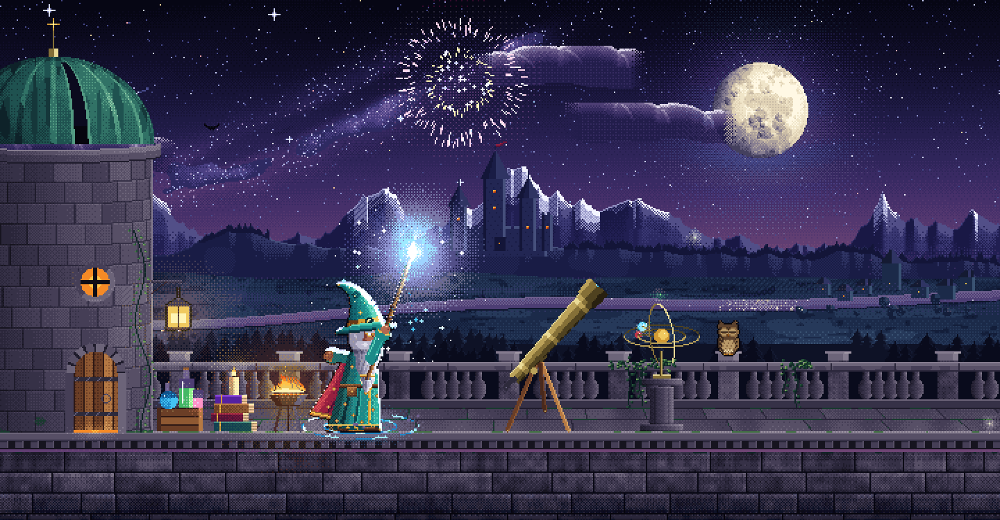
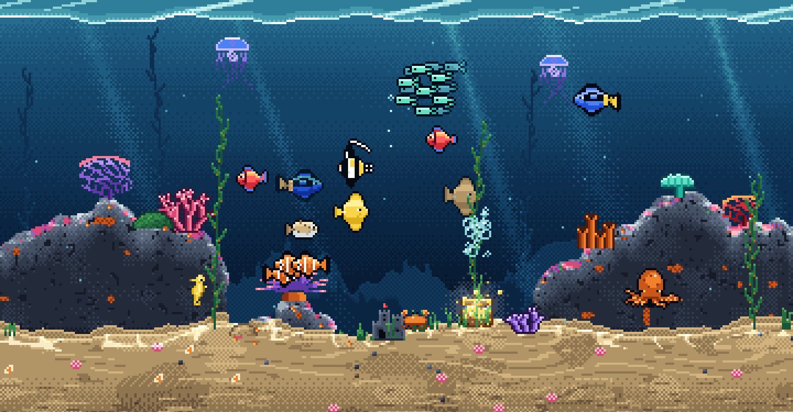

# Hearthglass

[](docs/videos/demo.mp4)

Have you always wanted an aquarium? Now you can have it, right on your desktop :)

Based on [Desktop Habitats](https://github.com/chaseleantj/desktop-habitats) by Chase Lean.

The fish react to your cursor and compete for food, while the plants sway in a slow current. There are four environments: two 3D aquariums, **Riverscape**, a planted freshwater tank, and **Reefscape**, a saltwater tank; and two pixel-art scenes, **Moonspire**, a wizard atop his moonlit observatory, and **Pixel Reef**, a hand-pixelled reef tank.


The aquariums are rendered live with Three.js and WebGL2. Everything runs locally, with no account or internet connection needed after setup. Desktop wallpaper support is available for **macOS and Windows**; every environment also runs in a browser. The app starts with Riverscape and remembers the environment you pick from its menu.

## The pixel scenes



**Moonspire** is a wizard on the roof of his observatory tower: a copper-domed turret, a brass telescope trained on the moon, an orrery, books, potions, a lantern and a crackling brazier, with an owl on the balustrade and a river valley, a village and a castle below. Everything in it is interactive:

- **Hold on the moon** and he raises his staff to charge a spell: sparks spiral into the gem, runes turn at his feet and the staff crackles once it is full. Let go and the bolt flies. A short hold cracks the moon; a full charge, or enough small ones, blows it apart. He looks as surprised as you are, loses his hat, then mends the moon piece by piece.
- **Don't hold it too long.** Kept at full power for a few seconds, the spell goes off in his face.
- **Tap or hold on the sky** for fireworks, bigger the longer you charge.
- **Tap the owl**, the **brazier**, the **lantern**, the **orrery** or the **wizard** himself; tap the **telescope** and he spots a shooting star. Left alone, he amuses himself now and then.



**Pixel Reef** is a reef tank with clownfish in their anemone, tangs, a moorish idol, flame angels, a school of chromis, a pufferfish, jellyfish, a seahorse, a crab and an octopus in its cave.

- **Tap the water** to drop food; **hold** to hand-feed a trickle; **drag** to stir the water and push the fish around.
- **Tap the pufferfish** to make it puff up, or hold to keep it puffed. Tap the **treasure chest**, the **castle**, the **octopus's cave** (twice, if you dare), the **crab**, a **jellyfish** or the **anemone**.
- **L** (or the lamp button) switches the tank light off: the jellyfish and some corals glow in the dark. On the desktop the light follows the clock, going off in the evening.

Moonspire is drawn at about 360 pixels tall (180 in Eco quality, for a chunkier, more retro look) and Pixel Reef at about 180, each scaled up by a whole number so pixels stay square and crisp on any screen; the scene widens to fit the screen's shape instead of letterboxing. Every colour on screen comes from a fixed palette of hue-shifted ramps: light, shadow, glow and fog are lookup tables from one palette colour to another, blended with an ordered dither. In testing, a frame took about 2 ms of CPU to draw, Moonspire's explosions included.

## Install on Mac

You need macOS 13 or newer and the Xcode command line tools. To install the tools, open Terminal and run:

```sh
xcode-select --install
```

Wait for that installation to finish. Download and unzip this repository, or clone it, then open Terminal in the project folder and run:

```sh
sh wallpaper/install.sh
```

The script builds the app for your Mac, installs it at `~/Applications/Hearthglass.app`, and starts it. It also adds a login item so the aquarium starts when you sign in. Allow about 20 seconds for the first frame to appear.

During installation, macOS may ask whether Terminal can control System Events. This lets the installer set a still image of the aquarium as your desktop picture, underneath the animation. You can decline; the live wallpaper will still work.

## Install on Windows

You need Windows 10 or Windows 11.

### Download (recommended)

1. Download **[Hearthglass-win-x64.zip](https://github.com/hearthglass/hearthglass/releases/latest/download/Hearthglass-win-x64.zip)** from the [latest release](https://github.com/hearthglass/hearthglass/releases/latest).
2. Unzip it anywhere, open the `Hearthglass` folder and double-click **`Install.cmd`**.

Nothing else needs installing; .NET comes bundled. Windows may show "Windows protected your PC" because the app is not code-signed: choose **More info**, then **Run anyway**.

### Build from source

You need the [.NET 8 SDK](https://dotnet.microsoft.com/download). Clone or download this repository, then double-click [`Install.cmd`](Install.cmd) in the project folder, or run in PowerShell:

```powershell
powershell -ExecutionPolicy Bypass -File wallpaper/install.ps1
```

Or with npm:

```sh
npm run wallpaper:win
```

Either way, Hearthglass installs to `%LOCALAPPDATA%\Programs\Hearthglass`, adds shortcuts to your Start Menu, desktop and Startup folder, and starts straight away. If you had it installed under its earlier name, Desktop Habitats, the installer replaces that copy and keeps your settings.

### Uninstall
- Open the Windows Start Menu and select **Uninstall Hearthglass**
- Or double-click [`Uninstall.cmd`](Uninstall.cmd) in the project folder, or run `npm run unwallpaper:win`

## Use the wallpaper

Click the fish icon in the menu bar (macOS) or system tray (Windows):

- **Environment** switches every screen between Riverscape, Reefscape, Moonspire and Pixel Reef, and remembers your choice.
- **Feed** drops ten pellets into each screen's tank, or eight in Reefscape. Uneaten pellets dissolve after 20–40 seconds of running simulation time in Riverscape and 36 seconds in Reefscape, measured from when they touch the water. In Moonspire it casts a full-power spell at the moon instead.
- **Pause / Resume** controls the animation. Your choice is remembered across restarts.
- **Quit** closes the app until you open it again or next sign in.

On Windows the tray menu also has:

- **Fish behaviour**: **Shy** fish dart away from a fast-moving cursor. **Curious** fish gather around a nearby cursor and lose interest after it sits still for a while; a sudden lunge still startles them.
- **Population**: Few, Normal, Lots or Crowded. Changing it restocks every tank.
- **Add a fish** sends one more fish swimming in from the side of the tank under your cursor, up to 20 extra. Added fish last until the population changes or the app restarts.
- **Click to feed**: a single click on empty desktop drops a pinch of food at that spot. Clicks on icons, double-clicks and quick repeats are ignored.
- **Select fish by dragging**: fish inside the blue box Windows draws when you drag on the desktop light up and turn to look.
- **Play with the wallpaper** (or **Ctrl+Alt+F**): the desktop stops responding to the mouse so you can play with the fish. Drag to select fish, drag again to herd them, right-click to feed, and press Esc, Ctrl+Alt+F or the **Done** button on the banner to stop. The taskbar stays usable throughout, and play ends by itself after a minute without input.

In the pixel scenes the same controls do what makes sense there: **Add a fish** adds a firefly to Moonspire, a click is a tap (a quick spell, a pinch of food, a poke), and a drag is a held press (charging a spell, stirring the water). In play mode, press and hold still for a moment to charge a spell or hand-feed; right-click taps.

Move your cursor near the fish to see them react. Desktop icons, clicks and dragging work as usual outside play mode.

## FAQ

### Does it work on Windows or Linux?

Desktop wallpaper support is available for **macOS and Windows**. Linux users can still enjoy every environment directly in a browser.

### Will it drain my battery?

It uses more power than a still wallpaper because it renders a 3D scene. The amount depends on your Mac, screen resolution and number of displays. There isn't a measured battery-life estimate yet.

Both scenes use the same quality profiles and stop rendering when paused or hidden. The wallpaper also responds to window coverage, battery power, Low Power Mode and screen sleep.

With the default Balanced profile, the two aquariums use these limits:

| Desktop state | Frame rate |
| --- | --- |
| Clearly visible, plugged in or on battery | Up to 30 fps |
| Mostly covered by windows | Up to 20 fps |
| Almost entirely covered | Stopped |
| Low Power Mode, locked screen or sleeping display | Stopped |

Pause it from the menu when you want a still aquarium, or quit to close the app completely. The browser previews offer Eco, Balanced and Detail profiles; actual frame rates depend on the device and scene. Battery life has not been measured.

### Does it monitor my keystrokes?

No. The wallpaper does not listen to typing in other apps or record keystrokes. Both browser previews handle Space to pause or resume, F for fullscreen, and H to hide or show controls while the aquarium has focus.

The wallpaper reads your cursor position so the fish can react. It also checks window positions and sizes to estimate how much of the desktop is visible. It does not capture the contents of those windows, store cursor history, or send this information anywhere.

### Does it need internet access or special permissions?

Once installed, the aquarium works offline. Its code, textures and Three.js library are bundled with the app. There are no analytics or external services.

The app does not request Accessibility, Input Monitoring or Screen Recording access. The optional System Events prompt during installation is for changing the still desktop picture.

### Why have the fish stopped moving?

Open the fish menu to see the current status. The wallpaper stops when it is almost entirely covered, in Low Power Mode, and while the screen is locked or asleep.

If Reduce Motion is enabled in macOS, the aquarium starts paused unless you have already saved a different choice. Choose **Resume** to animate it. Low Power Mode must be turned off before animation can resume.

### Can I use multiple monitors?

Yes. Each display gets its own aquarium, and **Feed** drops food on every display. Each tank renders separately, so more displays can increase power use.

### Do I need to leave Terminal open?

No. The installed app has its own copy of the scene and runs independently. You can close Terminal once installation finishes.

### How do I update it?

On Windows, download the zip from the [latest release](https://github.com/hearthglass/hearthglass/releases/latest) and run its `Install.cmd` again; your settings are kept.

On macOS, download or pull the latest source, then rerun `sh wallpaper/install.sh` from the project folder. Editing the source alone does not update the installed app. If you installed an earlier version under the name Aquatica or Desktop Habitats, the installer removes its app and login item before starting Hearthglass. Its old still image and saved preference are left behind; the new app starts with its own preference.

### How do I remove it and get my old wallpaper back?

From the project folder, run:

```sh
sh wallpaper/uninstall.sh
```

Or use `npm run unwallpaper`. This stops the app, removes its login item and deletes the installed app.

The still image at `~/Pictures/Hearthglass.png` stays behind, along with the desktop picture setting. Choose your previous wallpaper in System Settings, then delete the image if you no longer want it. The saved pause and environment preferences are also retained.

## Try it in a browser

With Node.js 20 or newer, run this from the project folder:

```sh
npm start
```

Open [the local preview](http://127.0.0.1:8080). There is no `npm install` step; the library is included. Use `PORT=8081 npm start` if port 8080 is busy, and Ctrl+C to stop the server.

- Click the water to drop food.
- Move the pointer near the fish to interact.
- Swipe or scroll through the gallery, or use the left and right arrow keys. Open the image or name to enter a scene.
- Use **Pause / Resume**, **Feed**, **Fullscreen** and **Hide controls** in any scene. **Show controls** brings the controls back. In the pixel scenes, **E** casts a spell (Moonspire) or feeds (Pixel Reef), and **L** switches Pixel Reef's tank light.
- Press **Space** to pause or resume, **F** for fullscreen, and **H** to hide or show controls while the aquarium has focus.
- **Quality** offers Eco (20 fps), Balanced (30 fps, the default) and Detail (60 fps). The selection is shared between the scenes and remembered. These are frame-rate caps; lower profiles also reduce rendering resolution. The pixel scenes are light enough to run at 60 fps on Balanced and Detail, and 30 on Eco or on battery.

Reduce Motion starts the preview paused. Serve the page over HTTP; opening `index.html` directly will not load its JavaScript modules. Any static server also works, such as `python3 -m http.server 8080 --bind 127.0.0.1` if you have Python installed.


## Credits and license

Hearthglass is [MIT licensed](LICENSE). Three.js 0.180.0 is bundled under its [MIT license](vendor/THREE-LICENSE.txt).

The rock, wood and sand textures come from Poly Haven under [CC0](https://polyhaven.com/license): [Rock Boulder Dry](https://polyhaven.com/a/rock_boulder_dry), [Rough Wood](https://polyhaven.com/a/rough_wood) and [Sand 01](https://polyhaven.com/a/sand_01). Reefscape's rock mesh, pore maps, coral texture and organism meshes are procedural, generated by the scripts in `tools/`. The pixel scenes' art is drawn by their own code; `node tools/pixel-snapshot.mjs moonspire docs/images/moonspire-wide.png` (or `pixelreef`) renders their gallery stills without a browser.
